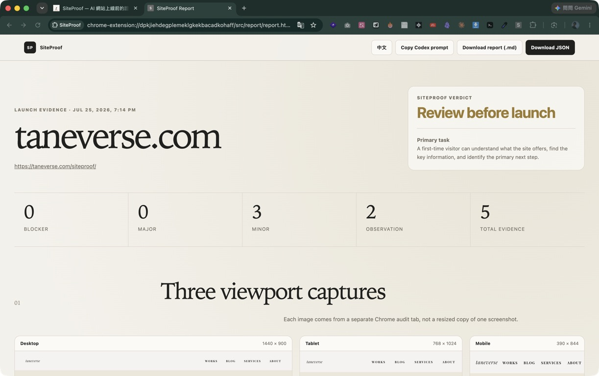

# SiteProof

[](https://github.com/raywang1025/siteproof/actions/workflows/ci.yml)
[](https://github.com/raywang1025/siteproof/releases/latest)
[](./LICENSE)

**Evidence-first launch checks for AI-built websites.**

SiteProof is a local-first Chrome Extension PoC. Give it one public page and it
captures Desktop, Tablet, and Mobile evidence, checks common launch risks, and
produces a report plus a repair prompt for Codex or Claude.

[Product page](https://taneverse.com/siteproof/) ·
[Download v0.1.0](https://github.com/raywang1025/siteproof/releases/latest) ·
[Read a sample report](./examples/sample-report.md)



## From a URL to repair evidence

1. **Open** the public page you want to ship.
2. **Audit** three independent Chrome viewports with one extension action.
3. **Review** evidence, export Markdown or JSON, or copy a repair prompt back
   into Codex or Claude.

The interface defaults to English for global open-source use. The popup and
report include a persistent Traditional Chinese switch. Rule IDs, JSON fields,
and the repair-prompt format stay in English so integrations have one stable
schema.

## What the PoC checks

- three viewport screenshots: 1440×900, 768×1024, and 390×844;
- JavaScript exceptions, Console errors, HTTP errors, and failed resources;
- horizontal overflow, offscreen elements, and fixed layouts that shrink on
  mobile;
- grouped 24px minimum touch-target failures and 44px mobile comfort
  observations;
- missing title, description, image `alt`, page language, or main landmark;
- heading structure and unnamed controls;
- basic estimated text contrast;
- evidence-linked UX heuristic risks;
- a launch verdict, JSON evidence, a Markdown report, and a repair prompt.

SiteProof labels what it can prove:

- **Confirmed issue** — direct browser or DOM evidence.
- **Potential UX risk** — evidence mapped to a heuristic.
- **Needs human review** — cannot be proven without a real task and participant.

## Try the PoC

### Install the release

1. Download `siteproof-v0.1.0.zip` from the
   [latest release](https://github.com/raywang1025/siteproof/releases/latest).
2. Unzip it.
3. Open `chrome://extensions`.
4. Enable **Developer mode**.
5. Choose **Load unpacked** and select the unzipped folder containing
   `manifest.json`.
6. Open a public website, click SiteProof, and choose **Start audit**.

Chrome shows a debugger notice while SiteProof audits temporary tabs. This is
expected.

### Run from source

```bash
git clone https://github.com/raywang1025/siteproof.git
cd siteproof
npm test
npm run check
```

Then load the repository root as an unpacked extension.

No runtime package installation, build step, OpenAI API key, or Anthropic API
key is required.

## Example output

- [Full Markdown audit report](./examples/sample-report.md)
- [JSON fixture report](./examples/sample-report.json)

The JSON example comes from the deliberately broken local fixture. Base64
screenshots are omitted to keep the repository small; a real export includes
them.

## Why a Chrome Extension?

The intended user is a creator or designer already looking at the site they
want to ship. A toolbar action removes the Node.js and Terminal setup required
by a local Playwright server.

Chrome's
[`debugger` API](https://developer.chrome.com/docs/extensions/reference/api/debugger)
provides supported DevTools Protocol domains for Emulation, Page, Runtime, Log,
and Network inspection. This permission is powerful, so SiteProof:

- opens isolated temporary audit tabs;
- attaches only while a viewport is being checked;
- detaches and closes every temporary tab;
- never uploads evidence;
- keeps reports in local extension storage;
- publishes the full source.

Read [SECURITY.md](./SECURITY.md) before installing the PoC.

## Default primary task and UX heuristics

> A first-time visitor can understand what the site offers, find the key
> information, and identify the primary next step.

You can replace this task before every audit. The heuristic report uses
[Jakob Nielsen's 10 usability heuristics](https://www.nngroup.com/articles/ten-usability-heuristics/)
as an organizing framework. SiteProof is independent and is not affiliated with
or endorsed by Nielsen Norman Group.

## Test the rule engine

The repository includes a deliberately broken site:

```bash
npm run fixture
```

Open `http://127.0.0.1:4173/`, run SiteProof, and expect findings for a mobile
fixed-layout mismatch, missing metadata, missing image alt, touch comfort, low
contrast, a failed image, and a deliberate JavaScript exception.

## Current status

`v0.1.0` is a validated technical proof of concept. A PoC report is not a
production security audit, accessibility certification, or substitute for
usability testing.

Not in the PoC:

- multi-page crawling or authenticated/private pages;
- form submission, purchase flows, or automatic code changes;
- AI API calls;
- `brand.md`, Pisci System, or Design System semantic review;
- cloud accounts, report history, or subscriptions.

## Architecture and validation

- [Architecture](./docs/architecture.md)
- [UX heuristic model](./docs/ux-heuristics.md)
- [Browser validation](./docs/validation.md)
- [Changelog](./CHANGELOG.md)

## Contributing

Bug reports, documentation fixes, and evidence-backed rule proposals are
welcome. Start with the
[contribution guide](./CONTRIBUTING.md), use an
[issue form](https://github.com/raywang1025/siteproof/issues/new/choose), or
[fork the repository](https://github.com/raywang1025/siteproof/fork) and open a
pull request.

## Roadmap

- [x] three-viewport capture and deterministic DOM checks;
- [x] Console, Runtime, and Network evidence collection;
- [x] UX heuristic evidence states;
- [x] JSON, Markdown, and repair-prompt export;
- [ ] review a mature accessibility engine for license and bundle size;
- [ ] add optional `brand.md` / Pisci rule input;
- [ ] add an optional BYOK AI interpretation layer;
- [ ] prepare Chrome Web Store privacy disclosures after the PoC is stable.

## License

[MIT](./LICENSE)
